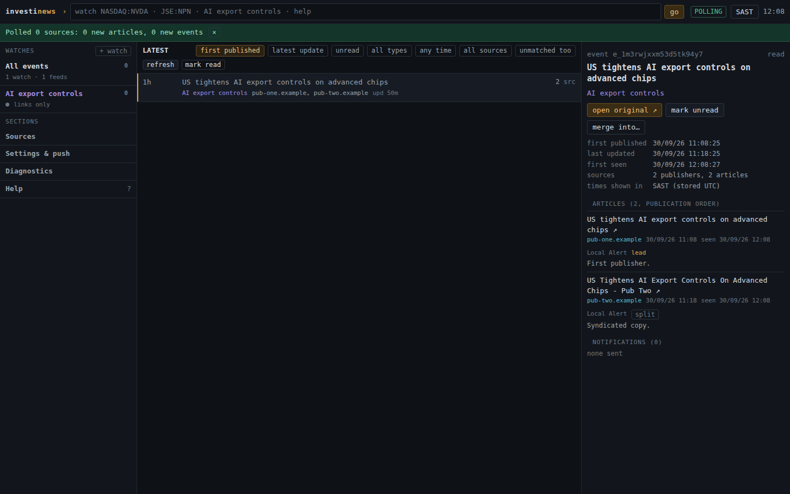
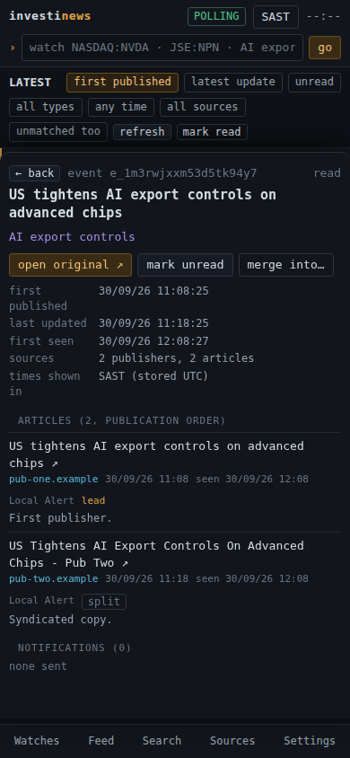

# Investinews

A personal market news terminal. Save watches for tickers (`NASDAQ:NVDA`, `JSE:NPN`) and topics (`AI export controls`), let a scheduler ingest official and user-supplied feeds, see duplicates grouped into single events, and get one Web Push notification per genuinely new event, on desktop or as an iPhone Home Screen app.

Free to run: no paid data, no LLM. Every source is honest about its status; see [docs/sources.md](docs/sources.md) for the exact source matrix and limits. Not affiliated with Bloomberg or any data vendor; nothing here is real-time.



## Features

- One command bar: `watch NASDAQ:NVDA`, `watch JSE:NPN`, `watch AI export controls`, `unwatch`, `open n`, `read n`, `mute`, `refresh`, `filter`, `sources`, `settings`, `help`. Bare symbols ask you to confirm the exchange.
- Persistent ingestion (SQLite locally, Cloudflare D1 when deployed) with idempotent upserts, ETag/Last-Modified, per-source backoff and cooldown, overlap-safe job lock, retention pruning.
- Deterministic clustering: SEC accession → exact URL → normalized title (syndication) → bounded fuzzy match with shared ticker/watch context. Different quarters, different accessions and corrections never merge. Manual merge/split with an override log; no repeated push after either.
- Unified LATEST feed (first-published order by default, latest-update toggle; old events are never reordered by re-fetches), per-watch feeds, filters by watch/source/type/unread/window, full-text search, read state that survives restarts.
- Web Push with VAPID: one notification per event per device (multiple watches coalesced), zero pushes on the initial backfill, idempotent across retries and restarts, per-watch scope (all / material / none), mute, quiet hours (Africa/Johannesburg), digest mode, opt-in update notifications, test button, expired-subscription cleanup.
- Terminal-style PWA: dense monospace UI, keyboard shortcuts (`/`, `j`/`k`, `Enter`, `o`, `m`, `u`, `r`, `Esc`, `?`), single-column mobile layout with a detail sheet, installable, offline shell.

## Run locally (single user, no login)

```bash
npm install
cp .env.example .env           # set SEC_USER_AGENT to your app name + email
npm run vapid                  # paste the printed keys into .env to enable push
npm run build                  # builds the frontend into dist/
npm start                      # http://localhost:8787  (API + UI + scheduler)
```

Development with hot reload: `npm run dev` (Vite on :5173 proxies `/api` to the Node server on :8787).

Tests: `npm test` (unit + integration), `npm run typecheck`, `npm run test:e2e` (Playwright browser test; needs the `playwright` package and a Chromium install).

Data lives in `data/investinews.sqlite` (change with `DATABASE_PATH`). Migrations in `migrations/` apply automatically at start. Export JSON from Settings; delete everything from Settings → Data.

## Deploy on Cloudflare Pages (always-on, closed-app push)

The same code runs as a Pages project: static frontend from `dist/`, API as Pages Functions (`functions/api/[[path]].ts`), storage in D1.

```bash
npm install -g wrangler && wrangler login
wrangler d1 create investinews                 # copy database_id into wrangler.toml
wrangler d1 migrations apply investinews --remote
wrangler pages project create investinews --production-branch main
npm run vapid                                  # generate keys once
wrangler pages secret put APP_TOKEN            # required: protects your watchlist and feed URLs
wrangler pages secret put JOB_TOKEN            # required: lets the cron trigger the poll job
wrangler pages secret put VAPID_PUBLIC_KEY
wrangler pages secret put VAPID_PRIVATE_KEY
wrangler pages secret put VAPID_SUBJECT        # mailto:you@example.com
npm run cf:deploy                              # vite build + wrangler pages deploy dist
```

Set `SEC_USER_AGENT` (and `APP_TZ`) in `wrangler.toml` `[vars]` or the Pages dashboard, then bind the D1 database to the project (Pages → Settings → Functions → D1 bindings → `DB`) if you created the project in the dashboard.

**Scheduler.** Pages has no cron, so something must call `POST /api/jobs/poll` with header `X-Job-Token: <JOB_TOKEN>` every few minutes. Two ready options:

1. GitHub Actions: `.github/workflows/poll.yml` runs every 5 minutes; add repository secrets `POLL_URL` (e.g. `https://investinews.pages.dev/api/jobs/poll`) and `JOB_TOKEN`.
2. A tiny Cloudflare Worker with a Cron Trigger: `cd worker && wrangler secret put JOB_TOKEN && wrangler deploy` (edit `POLL_URL` in `worker/wrangler.toml`).

Continuous deployment: `.github/workflows/deploy.yml` deploys on every push to `main` when `CLOUDFLARE_API_TOKEN` and `CLOUDFLARE_ACCOUNT_ID` secrets exist.

Local emulation of the Pages build: `npm run cf:build && npm run cf:migrate:local && npm run cf:dev` (D1 runs locally through Miniflare; put dev secrets in `.dev.vars`, see `.dev.vars.example`).

### Storage and hosting requirements

| Mode | Storage | Scheduler | Push while app closed |
| --- | --- | --- | --- |
| Local `npm start` | SQLite file | built-in timer (`POLL_INTERVAL_SEC`) | only while the machine and server run; needs HTTPS for push on other devices |
| Cloudflare Pages + D1 | D1 (SQLite-compatible, persistent) | external cron → `/api/jobs/poll` | yes: Pages Functions send Web Push when the cron polls |
| Any Node host (VPS, Fly, Railway) | SQLite volume or Postgres via a new `Db` adapter (`src/server/db.ts`; SQL is standard, FTS5 is optional) | built-in timer | yes with HTTPS |



## iPhone Home Screen push

1. Deploy over HTTPS (Pages does this) and set the VAPID secrets.
2. On the iPhone (iOS 16.4+): open the site in Safari → Share → **Add to Home Screen**.
3. Open the app **from the Home Screen icon**, go to Settings → **enable notifications**, accept the permission prompt.
4. Press **send test notification**. The delivery ledger under Diagnostics shows the push service response.
5. Close the app; the next cron poll that finds a new matching event sends a notification to the phone.

Details: <https://webkit.org/blog/13878/web-push-for-web-apps-on-ios-and-ipados/>.

## Configuration

See `.env.example`. `APP_TOKEN` is optional on localhost and mandatory anywhere reachable from the internet (the API returns 401 without it, and the UI shows a sign-in). Feed URLs (Google Alerts feed URLs are private tokens), push endpoints and the VAPID private key never reach the client.

## Project layout

```
migrations/            SQL migrations (shared by node:sqlite and D1)
src/core/              runtime-agnostic logic: rss, url, text, match, cluster, webpush, time
src/server/            db adapters, adapters (sec, rss), ingest pipeline, notify, jobs, api (hono), node entry
functions/api/         Cloudflare Pages Function entry
worker/                optional cron Worker
web/                   PWA (Vite, vanilla TS), service worker in web/public/sw.js
tests/                 vitest unit + integration; src/scripts/e2e.ts browser test
docs/sources.md        source matrix, endpoints, terms, failure modes
```

## Limits (read this)

- Google News and Yahoo Finance are links only. Automatic headlines come from SEC EDGAR, Google Alerts RSS, publisher/IR feeds and the optional public presets.
- JSE SENS is a link only; attach an issuer RSS feed or plug a licensed distributor into the adapter interface.
- Relevance is keyword-based (ticker notation, issuer name/aliases, topic terms, user include/exclude terms). Common-word tickers (AI, ON, IT…) require explicit notation or the company name. Nothing is discarded silently: filter *unmatched too* shows everything ingested.
- Feeds are polled on a schedule; publishers add their own delays. Freshness labels are measured per source.
