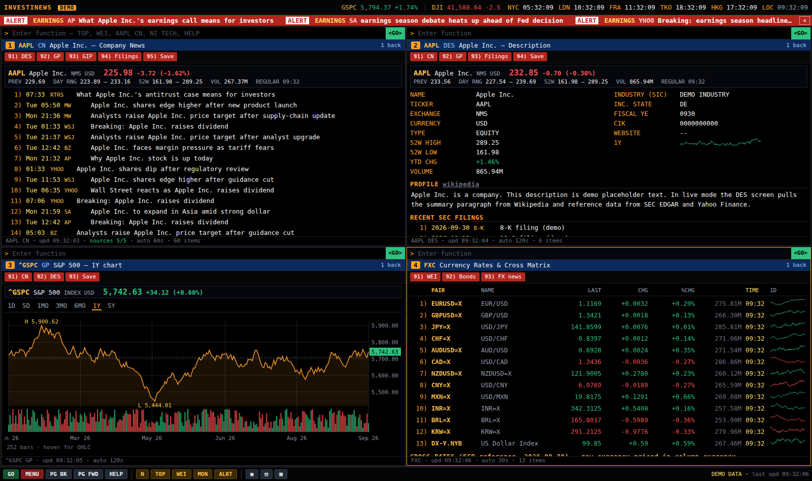

# Investinews — a free Bloomberg-terminal-style news monitor

Latest news on tickers and topics, for free, in a four-panel terminal UI that works the way a
Bloomberg terminal does: a command line per panel, mnemonic functions (`TOP`, `WEI`, `AAPL CN`,
`NI TECH`), numbered rows you open by typing the number and pressing `<GO>`, red function
toolbars, a scrolling tape, world clocks, and headline alerts. All data comes from free public
sources; there are no API keys to configure.



## Quick start

```bash
npm install
npm start                      # http://localhost:3000
TICKERS=AAPL,MSFT TOPICS=AI,FED npm start   # seed the watchlist ("given" tickers/topics)
DEMO=1 npm start               # offline demo data, no network needed
npm test
```

Open the terminal with tickers/topics in the URL to load them straight into the watchlist:

```
http://localhost:3000/?t=AAPL,MSFT,NVDA&topics=AI,FED&alerts=earnings
http://localhost:3000/?cmd=SPX%20INDEX%20GP
```

Saved tickers, topics, alerts and layout persist in `data/settings.json` on the server and in the
browser's local storage (the newer copy wins). Type `W` to see the share link for the current list.

## Functions

| Command | What it shows |
| --- | --- |
| `N` | My News: merged headlines for every saved ticker and topic, with a tab per item (`N AAPL`, `N AI`) |
| `TOP` / `TOP MKT` | Top news by category: TOP MKT ECO CEN TECH ENR CRYPTO POL WLD ASIA EUR EARN CORP MNA IPO FIN HLTH REAL |
| `NI <code>` | News by topic. Category codes above, ~90 topic codes (`NI AI`, `NI RATES`, `NI TARIFF`, `NI OIL`), or any word |
| `NSE <text>` | Free-text news search across Google News, Bing News, GDELT, Reddit and Hacker News |
| `<TICKER> CN` | Company news with a live quote header (`AAPL CN`, `AAPL US EQUITY CN`, `N AAPL`) |
| `<TICKER> DES` | Description: reference data, 52-week range, YTD, SEC profile, Wikipedia summary, recent filings |
| `<TICKER> GP` / `GIP` | Daily / intraday chart with volume, crosshair OHLC readout, 1D–5Y ranges |
| `<TICKER> CF` | SEC EDGAR filings (8-K, 10-Q, 10-K, Form 4...) |
| `<TICKER>` | Security menu (quote plus numbered functions) |
| `MON` | Watchlist monitor: quotes, sparklines and the latest headline for each saved ticker and topic |
| `W` | Watchlist editor: `W ADD AAPL,MSFT`, `W ADD NI AI`, `W DEL AAPL`, `W DEL NI AI`, `W CLR` |
| `ALRT` | Alerts: `ALRT ADD earnings`, `ALRT DEL 1`, `ALRT CLR`. Fires a red alert bar and optional desktop notification when any watched headline matches |
| `WEI` | World equity indices (Americas / EMEA / APAC) |
| `FXC` | Major currency pairs plus an ECB cross-rate matrix |
| `WB` | US Treasury yields, dollar index, bond ETFs |
| `CRYP` | Top 25 crypto assets with 1h/24h/7d change and 7-day sparklines |
| `MOST` | Trending tickers |
| `ECO` / `CEN` | Economic releases (BLS, BEA, CNBC Economy) and central banks (Fed, ECB, BoE) |
| `SECF <name>` | Security finder |
| `LAYOUT 1|2|4` | Panel layout |
| `HELP`, `REFRESH`, `MENU`, `CLR` | Reference, reload, back, clear |

Bloomberg security syntax is accepted and mapped to free-data symbols: `SPX INDEX`, `INDU INDEX`,
`UKX INDEX`, `NKY INDEX`, `EURUSD CURNCY`, `USDJPY CURNCY`, `CL1 COMDTY`, `GC1 COMDTY`,
`XBT CRYPTO`, `USGG10YR`, `VOD LN EQUITY`, `7203 JP EQUITY`. Yahoo-style symbols work directly.

## Keyboard

`Enter` = `<GO>` · `Esc` = `<MENU>` (back) · `Tab` = next panel · `Alt+1..4` = jump to panel ·
`PgUp/PgDn` = scroll · `↑/↓` = command history · type a row number + `<GO>` to open it ·
start typing anywhere to focus the active command line. Autocomplete suggests functions and
securities as you type.

## Data sources (all free, no keys)

News: Google News RSS, Bing News RSS, Yahoo Finance RSS, GDELT, Reddit, Hacker News, CNBC,
MarketWatch, WSJ and Dow Jones headline feeds, FT, BBC, Reuters and AP (via Google News), Federal
Reserve, ECB, Bank of England, BLS, BEA, SEC EDGAR, OilPrice, CoinDesk, Cointelegraph, TechCrunch,
The Verge, Ars Technica, Politico, PR Newswire, GlobeNewswire, Nikkei Asia, SCMP, Guardian,
Al Jazeera, Seeking Alpha, Investing.com.

Market data: Yahoo Finance public chart, trending and search endpoints (Stooq as quote fallback),
CoinGecko, Frankfurter (ECB reference rates), SEC EDGAR submissions, Wikipedia.

Every source is fetched server-side with timeouts, cached with a short TTL, and served stale if a
source is temporarily down. Each panel's status line shows how many sources responded. Feeds and
category mappings live in `server/sources/feeds.js`; add a feed there to extend a category.

SEC asks for a descriptive User-Agent: set `SEC_USER_AGENT="your app your@email"` if you run this
for real.

## Layout of the code

```
server/index.js          Express entry (PORT, HOST, DEMO, TICKERS, TOPICS, ALERTS, SETTINGS_FILE)
server/routes.js         /api/* endpoints
server/sources/          feeds (categories), search (ticker/topic news), market (quotes, charts), company (SEC, Wikipedia), misc (crypto, FX)
server/lib/              dependency-free RSS/Atom parser, headline normalisation and dedupe, TTL cache, article reader
server/demo.js           offline sample data providers (DEMO=1)
public/js/command.js     Bloomberg-style command parser and autocomplete
public/js/screens.js     every screen (news lists, DES, GP, WEI, FXC, CRYP, MON, W, ALRT, story reader...)
public/js/app.js         panels, navigation stacks, keyboard, tape, clocks, alerts, settings sync
test/                    node --test suites for the parser, normaliser, command line and API routes
```
